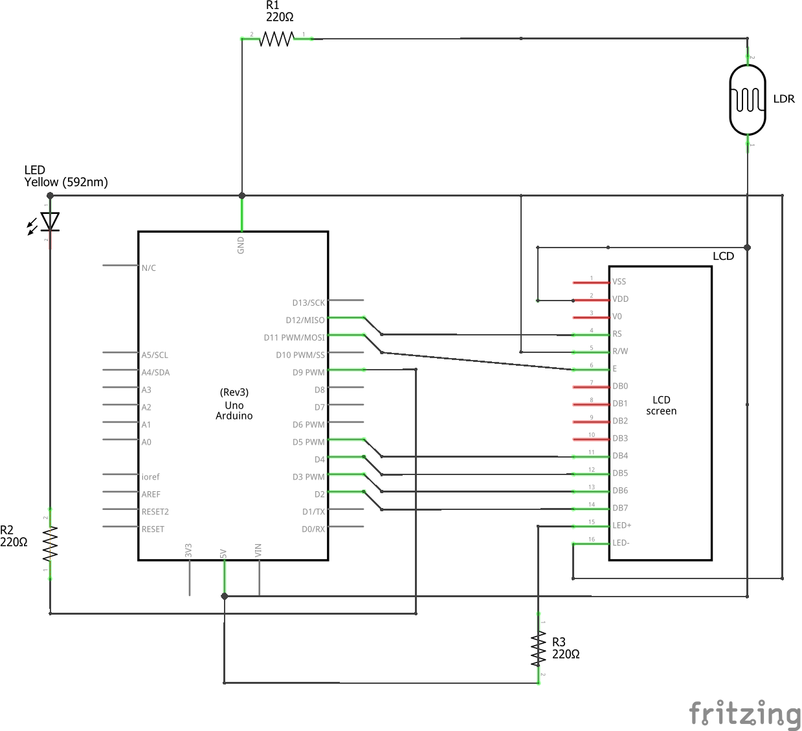

# Good-Light-For-Working
Task under "Embedded System Lab Training SS_2019" course, RCSE

### Group Members-
Manraj Singh, Saqib Nawaz, Tanvi Singh

### Breadboard

### Required Components
1. Arduino Uno Board with USB connector
2. Breadboard
3. LCD Screen (compatible with Hitachi HD44780 driver)
4. LDR(Light-Dependent Resistor)/Photocell
5. LED
6. 220 ohm resistor x 4
7. Jumper wires x 30

### Schematic

